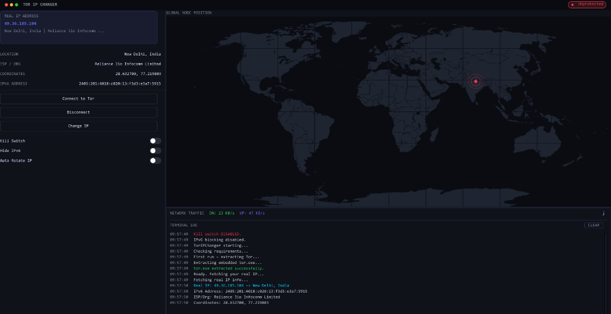

# 🛡️ Ip-Changer — Tor-Powered IP Anonymizer for Windows

<p align="center">
  
  
  
  
</p>

---

**Ip-Changer** is a premium, standalone Windows desktop application that routes your **entire system's internet traffic** through the **Tor anonymity network** — changing your public IP address and keeping your online identity private.

No installation required. Just run `Ip-Changer.exe` as **Administrator**.

---

## ✨ Features

| Feature | Description |
|---|---|
| 🔌 **One-Click Tor Connection** | Connect/disconnect to Tor with a single button. Bootstraps Tor automatically. |
| 🌐 **System-Wide Proxy** | Redirects ALL OS traffic (browsers, apps) through Tor's HTTP tunnel (port 9080) and SOCKS5 (port 9050). |
| 🔒 **Kill Switch** | Blocks ALL internet if Tor disconnects — your real IP is **never exposed**. |
| 🚫 **Hide IPv6** | Blocks all outbound IPv6 traffic via Windows Firewall to prevent IPv6 leak channels. |
| 🔄 **Change IP on Demand** | Request a fresh Tor circuit for a new exit IP instantly. |
| ⏱️ **Auto IP Rotation** | Automatically rotate your IP on a configurable countdown timer. |
| 🗺️ **Live Geo Map** | Real-time world map showing your current exit node's country, city, ISP, and coordinates. |
| 📊 **Traffic Monitor** | Live upload/download speed graph and terminal activity log. |
| 📦 **Self-Extracting EXE** | Fully standalone — embeds and auto-extracts `tor.exe` on first launch. No dependencies needed. |

---

## 📋 Requirements

- **Windows 10 / 11** (64-bit)
- **Administrator privileges** (required for Kill Switch, IPv6 blocking, and system proxy)
- **Internet connection**

---

## 🚀 Getting Started

1. **Download** `Ip-Changer.exe` from the [Releases](../../releases) page.
2. **Right-click** → **Run as Administrator**.
3. On first launch, `tor.exe` is automatically extracted — no manual setup needed.
4. Click **"Connect to Tor"** to start routing your traffic anonymously.
5. *(Optional)* Enable **Kill Switch** to block all traffic if Tor drops.
6. *(Optional)* Enable **Hide IPv6** to block IPv6 leak channels.

---

## 🔒 How It Works

```
Your PC  →  Tor Entry Node  →  Tor Relay  →  Tor Exit Node  →  Internet
```

1. Ip-Changer starts a local Tor process and configures it as your system proxy.
2. All HTTP, HTTPS, and SOCKS traffic from every app on your PC is routed through Tor.
3. Websites and services see the **Tor exit node's IP**, not your real IP.
4. The **Kill Switch** uses Windows Firewall rules to block all non-Tor traffic if the connection drops.
5. The **Hide IPv6** toggle adds firewall rules to block all outbound IPv6 packets, preventing leaks.

---

## ⚠️ Important Notes

- This tool **requires Administrator rights** to manage the system proxy and firewall rules.
- The Kill Switch and IPv6 rules are **automatically cleaned up** on application exit — no residue left behind.
- Tor exit nodes are operated by volunteers — do not use this tool for illegal activities.
- For maximum privacy, also consider disabling WebRTC in your browser.

---

## 🛠️ Technical Details

| Component | Technology |
|---|---|
| UI Framework | Dear ImGui + DirectX 11 |
| Charting | ImPlot |
| Networking | WinHTTP, Winsock2 |
| Proxy Management | WinINet + Registry |
| Firewall Rules | `netsh advfirewall` |
| Build | MinGW-w64 / GCC (C++17) |

---

## 📸 Screenshot



> Premium deep-space dark UI with live world map, real-time traffic graph, terminal log, and status indicators.

---

## 👤 Author

- **picxxy** - *Project Creator & Lead Developer* - [GitHub Profile](https://github.com/picxxy)

---

## 📜 License


This project is provided for **educational and privacy research purposes only**.  
Use responsibly and in compliance with your local laws and regulations.

---

## 🙏 Credits

- [Tor Project](https://www.torproject.org/) — The anonymity network powering this tool
- [Dear ImGui](https://github.com/ocornut/imgui) — Immediate mode GUI library
- [ImPlot](https://github.com/epezent/implot) — Plotting library for ImGui
